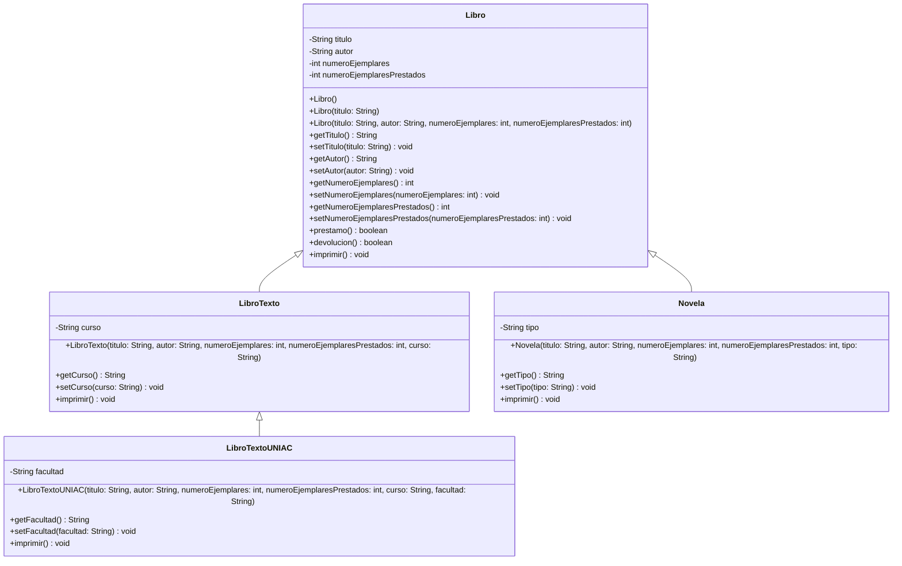

# Parcial practico 1
## Integrantes:

**-Jahel Alejandro Gutierrez Enriquez**

**-Alejandro Mosquera Corrales**

<br>

---
# Diagrama UML 


<br>
<br>

## Análisis de posibles fallas en la herencia

### 1. Clase Libro declarada como final

si esta clase se declarara con el modificador final:

```java
public final class Libro {
    // ...
}
```

La siguiente clase produciría un error de compilación:

```java
public class Novela extends Libro {
    // Error: no se puede heredar de una clase final.
}
```

Esto sucede porque una clase declarada como final no puede tener clases hijas.

### 2. Constructor de Libro declarado como private

LibroTexto inicializa los atributos heredados mediante una llamada a `super(...)`:

```java
public LibroTexto(String titulo, String autor, int numeroEjemplares, int numeroEjemplaresPrestados, String curso) {
    super(titulo, autor, numeroEjemplares, numeroEjemplaresPrestados);
    this.curso = curso;
}
```

Actualmente, esa llamada funciona porque el constructor de `Libro` es público:

```java
public Libro(String titulo, String autor, int numeroEjemplares,
             int numeroEjemplaresPrestados) {
    // ...
}
```

Pero si ese constructor se declarara como `private`:

```java
private Libro(String titulo, String autor, int numeroEjemplares,
              int numeroEjemplaresPrestados) {
    // ...
}
```

Las clases `LibroTexto` y `Novela` no podrían ejecutar `super(...)`, ya que un constructor privado solo puede utilizarse dentro de la propia clase `Libro`. Por ello, esas clases hijas no podrían inicializar correctamente la parte heredada.

<br>

## Propuesta de nuevos atributos y método

Se proponen los siguientes atributos para la clase Libro:

```java
private String editorial;
private int anioPublicacion;
```

- editorial: Representa la empresa o entidad que publicó el libro.
- anioPublicacion: registra el año en que fue publicado el libro.

También se propone el siguiente método:

```java
public int getEjemplaresDisponibles() {
    return numeroEjemplares - numeroEjemplaresPrestados;
}
```

Este método retorna la cantidad de ejemplares disponibles para préstamo, restando los ejemplares prestados al total de ejemplares.
